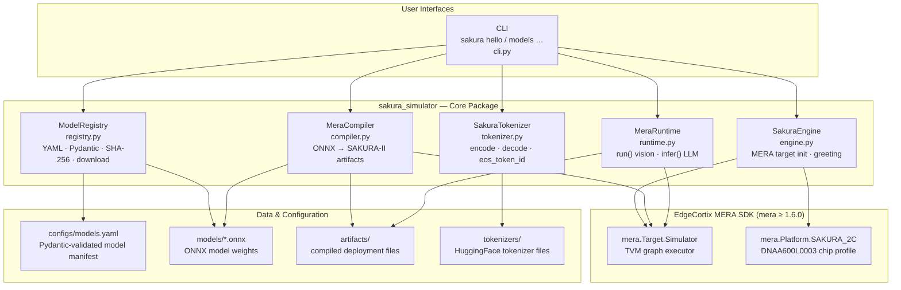

# mera-sakura-simulator

**SAKURA-II NPU Simulator** is a software-in-the-loop simulation platform for the [EdgeCortix SAKURA-II Neural Processing Unit](https://www.edgecortix.com/en/products/sakura). It drives the full [MERA framework](https://www.edgecortix.com/en/products/mera) compiler and runtime against `mera.Target.Simulator` so that model compilation, hardware-accurate inference, and LLM text generation can be developed, tested, and benchmarked without physical NPU hardware.

The project ships a **Typer CLI** (`sakura`), a **Pydantic-validated model registry**, and a **full autoregressive LLM inference pipeline** — all built with strict **Test-Driven Development (TDD)** and **Behavior-Driven Development (BDD)** practices, with 100% branch coverage enforced on every commit.

> Targets `mera.Target.Simulator` + `mera.Platform.SAKURA_2C` (`DNAA600L0003`). No physical NPU required.

---

## Features

- `SakuraEngine` — wraps [`mera.Target`](https://github.com/Edgecortix-Inc/mera) and `mera.Platform` for SAKURA-II NPU initialization
- **CLI** via [Typer](https://typer.tiangolo.com/): `sakura hello`, `sakura models list/inspect/download/remove/compile/run/infer`
- **Model Registry**: YAML-driven manifest with Pydantic schema validation, SHA-256 integrity checking, HTTP download via httpx, and disk-level remove
- **LLM Inference**: autoregressive text generation from a prompt — greedy or multinomial sampling, EOS-aware loop, latency reporting
- **SakuraTokenizer**: wraps HuggingFace `transformers.AutoTokenizer` with encode (optional truncation) and decode
- **Docker support**: multi-stage image with a `docker compose` CLI service
- **100% branch coverage** enforced by pytest-cov on every commit
- **BDD-style tests** with Given-When-Then structure, plus smoke tests for end-to-end workflows
- **Pre-commit hook** that blocks commits if tests fail
- **Claude Code integration**: custom slash commands, agent instructions, and NPU telemetry plugin

---

## Architecture



---

## Setup

### Manual Setup

```bash
# 1. Install Poetry (once per machine)
curl -sSL https://install.python-poetry.org | python3 -
export PATH="$HOME/.local/bin:$PATH"

# 2. Configure Poetry to create .venv inside the project
poetry config virtualenvs.in-project true

# 3. Install dependencies (add [llm] for HuggingFace tokenizer support)
poetry install
poetry install --extras llm   # optional: transformers + torch

# 4. Wire up the pre-commit hook
git config core.hooksPath .githooks

# 5. Run the test suite
poetry run pytest
```

### Docker Setup

Requires [Docker](https://docs.docker.com/get-docker/) with the Compose plugin. The multi-stage image installs the full MERA SDK (`mera[full]`) — the first build downloads ~2-3 GB of wheels and takes 10-20 minutes. Subsequent builds reuse the cached dependency layer.

> **Note:** `mera` wheels are `manylinux_2_27_x86_64` only. The image will not run natively on ARM64 (Apple Silicon, AWS Graviton).

```bash
# Build the image
docker compose build

# Run a CLI command (the container entrypoint is already "sakura" — pass only the subcommand)
docker compose run --rm cli hello
# Hello from Sakura-II: Titan Biosignature Engine Active

# List registered models
docker compose run --rm cli models list

# Download a model and verify its SHA-256 checksum
docker compose run --rm cli models download mobilenet_v2

# Compile a model (writes artifacts/ on the host via bind mount)
docker compose run --rm cli models compile mobilenet_v2

# Run inference from compiled artifacts
docker compose run --rm cli models run mobilenet_v2 --iters 3
```

Large data directories (`models/`, `artifacts/`, `tokenizers/`) are bind-mounted from the host workspace at runtime — they are never baked into the image.

#### LLM inference setup (one-time)

LLM models (e.g. `distilgpt2`) require a local tokenizer directory before `models infer` can run. The `tokenizers/` volume is mounted read-only, so use a one-off container with a writable mount to save the tokenizer files to the host:

```bash
# 1. Save the tokenizer to tokenizers/distilgpt2/ on the host
docker run --rm \
  -v "$(pwd)/tokenizers:/workspace/tokenizers" \
  --entrypoint python3 \
  sakura-simulator:latest \
  -c "
from transformers import AutoTokenizer
tok = AutoTokenizer.from_pretrained('distilgpt2')
tok.save_pretrained('/workspace/tokenizers/distilgpt2')
print('Done')
"

# 2. Compile the LLM model
docker compose run --rm cli models compile distilgpt2

# 3. Run LLM inference
docker compose run --rm cli models infer distilgpt2 --prompt "Hello"
docker compose run --rm cli models infer distilgpt2 --prompt "Hello" --max-new-tokens 32 --temperature 0.7
```

> **Note:** `distilgpt2` runs on the MERA Simulator (pure software). Expect ~1–2 s per token.

---

## Usage

### CLI

```bash
# Engine greeting
poetry run sakura hello
# Hello from Sakura-II: Titan Biosignature Engine Active

# List all registered models with Space-Ready integrity status
poetry run sakura models list

# Inspect NPU constraints for a specific model
poetry run sakura models inspect distilgpt2

# Download a model file and verify its SHA-256 checksum
poetry run sakura models download mobilenet_v2

# Remove a downloaded model file from disk
poetry run sakura models remove mobilenet_v2

# Compile a model into MERA deployment artifacts
poetry run sakura models compile distilgpt2

# Run inference from compiled artifacts (Simulator uses TVM graph executor)
poetry run sakura models run distilgpt2 --iters 1

# Run LLM inference — send a text prompt and get generated text back
poetry run sakura models infer tinyllama-1.1b --prompt "What is a biosignature?"
poetry run sakura models infer tinyllama-1.1b --prompt "Hello" --max-new-tokens 64 --temperature 0.7
```

---

## LLM Inference Pipeline

For models registered with `model_type: llm` in the manifest, the full generation pipeline is:

1. **Tokenize** — `SakuraTokenizer.encode(prompt, max_length=context_length)` produces `input_ids` and `attention_mask` as `int64` arrays
2. **Autoregressive loop** — each step feeds the runner, slices the last-position logits, and samples the next token via `_sample_next_token` (greedy at `temperature=0.0`, multinomial otherwise); stops on EOS or `max_new_tokens`
3. **Decode** — `SakuraTokenizer.decode(generated_ids)` converts token IDs back to text
4. **Result** — `InferResult(text, token_ids, latency_ms)` returned; all fields are typed primitives ready for a future protobuf serialization layer

Manifest entry example:

```yaml
- name: tinyllama-1.1b
  version: "1.0.0"
  path: models/tinyllama-1.1b.onnx
  checksum: "<sha256>"
  model_type: llm
  tokenizer_path: tokenizers/tinyllama
  context_length: 2048
  artifact_dir: artifacts/tinyllama-1.1b/1.0.0
  generation_config: {max_new_tokens: 128, temperature: 1.0}
  npu_constraints: {max_power_watts: 15.0, required_memory_mb: 2048}
```

---

## Test Coverage

169 tests across 8 test files. **100% branch coverage** enforced on every run.

| Module | Statements | Branches | Cover |
|---|---|---|---|
| `engine.py` | 30 | 0 | **100%** |
| `cli.py` | 120 | 18 | **100%** |
| `registry.py` | 79 | 18 | **100%** |
| `runtime.py` | 233 | 58 | **100%** |
| `tokenizer.py` | 24 | 2 | **100%** |
| `compiler.py` | 27 | 6 | **100%** |
| `__init__.py` | 3 | 0 | **100%** |
| **Total** | **516** | **102** | **100%** |

Run `poetry run pytest` to reproduce. HTML report: `open htmlcov/index.html`.

---

## Project Structure

```
src/sakura_simulator/
    engine.py        SakuraEngine — wraps mera.Target, owns the greeting constant
    cli.py           Typer CLI (hello, models list/inspect/download/remove/compile/run/infer)
    compiler.py      MeraCompiler — compile models into deployment artifacts
    registry.py      ModelRegistry — YAML loader, Pydantic validation, SHA-256, download, remove
    runtime.py       MeraRuntime — run() for vision, infer() for LLM; InferResult dataclass
    tokenizer.py     SakuraTokenizer — encode/decode wrapper over transformers.AutoTokenizer
    __init__.py      Package init, re-exports SakuraEngine

configs/
    models.yaml      Model manifest — vision and LLM entries with all supported fields

tests/
    conftest.py      mera stub + Typer/Click compat patch via sys.modules injection
    test_engine.py   BDD tests — SakuraEngine
    test_cli.py      BDD tests — CLI commands including models infer
    test_registry.py BDD tests — ModelRegistry + LLM manifest fields
    test_compiler.py BDD tests — MeraCompiler
    test_runtime.py  BDD tests — MeraRuntime, RunResult, runner internals
    test_tokenizer.py BDD tests — SakuraTokenizer (encode, decode, eos_token_id)
    test_infer.py    BDD tests — MeraRuntime.infer(), _sample_next_token, InferResult
    test_smoke.py    Smoke tests — full CLI workflows (download/remove/infer)

Dockerfile           Multi-stage build (builder + runtime); mera[full] + system libs
docker-compose.yml   cli service (one-shot CLI container)
.dockerignore        Excludes .venv, models/, artifacts/, tokenizers/ from build context
.claude/             Claude Code settings, agent instructions, slash commands
.claude_plugin/      NPU telemetry simulation plugin for Claude Code
.githooks/           pre-commit hook (runs pytest before every commit)
CLAUDE.md            Developer source of truth — all commands documented
```

---

## Development

See [CLAUDE.md](CLAUDE.md) for the full command reference and TDD workflow.

### TDD Cycle

```bash
# Red — write a failing test
poetry run pytest --no-cov -x

# Green — implement minimum code to pass
poetry run pytest --no-cov -x

# Refactor + verify coverage
poetry run pytest          # must show 100%
```

### All commands at a glance

| Command | Description |
|---------|-------------|
| `poetry run pytest` | Full suite + 100% branch coverage |
| `poetry run pytest --no-cov -x` | Fast TDD iteration |
| `poetry run ruff check src/ tests/` | Lint (E, F, W, I, UP rules) |
| `poetry run ruff format src/ tests/` | Auto-format |
| `poetry run sakura hello` | Engine greeting |
| `poetry run sakura models list` | List models with Space-Ready status |
| `poetry run sakura models inspect <name>` | Show NPU constraints for a model |
| `poetry run sakura models download <name>` | Download model + verify SHA-256 |
| `poetry run sakura models remove <name>` | Remove downloaded model from disk |
| `poetry run sakura models compile <name>` | Compile model into deployment artifacts |
| `poetry run sakura models run <name> [--iters N]` | Run inference from compiled artifacts |
| `poetry run sakura models infer <name> --prompt "..."` | LLM text generation |

---

## MERA SDK

This project depends on the real [EdgeCortix MERA SDK](https://github.com/Edgecortix-Inc/mera) (`mera>=1.6.0` from PyPI). `SakuraEngine` uses:

- **[`mera.Target.Simulator`](https://github.com/Edgecortix-Inc/mera)** — software simulation target (no physical hardware needed)
- **`mera.Platform.SAKURA_2C`** — the [SAKURA-II](https://www.edgecortix.com/en/products/sakura) chip platform (`DNAA600L0003`)

The [MERA framework](https://www.edgecortix.com/en/products/mera) supports PyTorch, TensorFlow, and ONNX models with INT8 quantization and multiple deployment backends.

`mera` is stubbed in tests via `sys.modules` injection in `conftest.py` so the real SDK (and its heavy transitive dependencies) is never imported during the test run.

---

## License

MIT — see [LICENSE](LICENSE).
